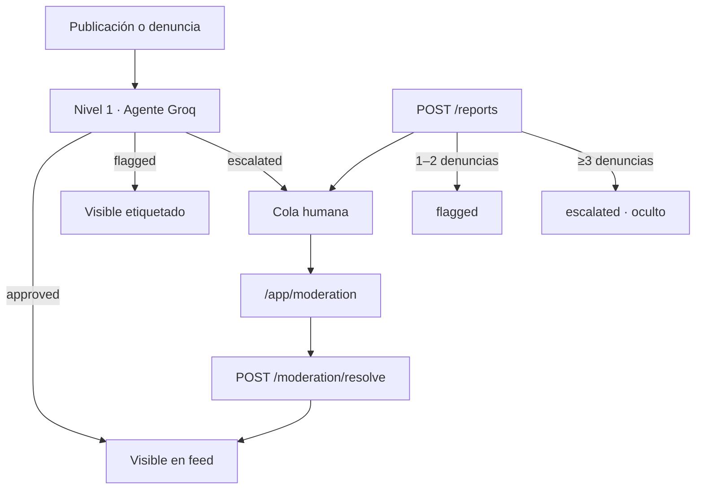

# Agente moderador (Capa 2)

Moderación **proactiva** off-chain para la plataforma de opinión anónima. Opera solo
sobre **contenido + `platformId`** (seudónimo). Nunca address del KYC ni PII.

Rama de trabajo: `feat/moderator-agent`.

## Arquitectura (dos niveles)



## Nivel 1 — Agente (Groq)

- **Paquete:** `platform/curation`
- **Proveedor:** [Groq](https://groq.com) (`groq-sdk`)
- **Modelo default:** `llama-3.3-70b-versatile` (`CURATION_MODEL`)

### Qué detecta (rúbrica acotada)

| Caso | Acción típica |
|------|----------------|
| Ilegal, +18 explícito, gore | `escalated` |
| PII / datos sensibles de terceros (doxxing) | `escalated` o `flagged` |
| Pierde el hilo (respuestas off-topic vs. padre) | `flagged` |
| Opinión legítima | `approved` |

**Regla de oro:** no moderar por postura ni opinión impopular.

### Curaduría proactiva (sin esperar denuncias)

Toda publicación pasa por el agente **antes** de persistirse como visible:

| Endpoint | Tipo |
|----------|------|
| `POST /content` | posts del feed |
| `POST /posts/:id/replies` | respuestas (+ contexto del padre) |
| `POST /articles` | artículos long-form |
| `POST /articles/:id/opinions` | opiniones sobre artículos |

- `escalated` → **no aparece** en feed, hilos ni listados hasta revisión humana.
- Fail-safe: error del modelo o JSON inválido → `escalated`.

## Denuncias de usuarios

- **Endpoints:** `POST /reports`, `GET /reports/check`
- **Store:** `platform/curation/.reports-store.json` (gitignored)
- **UI:** menú "Denunciar" en posts y perfiles (`PostMenu`, `ProfileActions`)

### Comportamiento

1. Un usuario denuncia (`platformId` del denunciante + `targetId` + motivo).
2. Dedup: **1 denuncia por usuario y target**.
3. El caso entra/actualiza la **cola de moderación** (`source: report`).
4. Efecto sobre el contenido:
   - **1–2 denuncias** → `flagged` (visible con etiqueta).
   - **≥3 denuncias** (configurable) → `escalated` (oculto).
5. Si el agente ya escaló, las denuncias suman contexto en cola (`source: both`).

Variable opcional: `REPORT_ESCALATE_THRESHOLD` (default `3`).

## Nivel 2 — Moderación humana

- **Cola:** `platform/curation/.moderation-queue.json`
- **API:** `GET /moderation/queue`, `POST /moderation/resolve`
- **UI:** `/app/moderation` (shell social, acceso desde Configuración)

El moderador ve solo seudónimo (@últimos 5 del `platformId`) y contenido.

## Variables de entorno

```bash
# Obligatorio en staging/prod (sin esto → fail-safe escalated)
GROQ_API_KEY=gsk_...

# Opcional
CURATION_MODEL=llama-3.3-70b-versatile
REPORT_ESCALATE_THRESHOLD=3

# Solo dev local sin Groq (auto-aprueba todo)
# CURATION_DISABLED=true
```

Ver también `.env.example`.

## Desarrollo local

```bash
GROQ_API_KEY=gsk_... npm run serve -w @behuman/api
npm run dev -w @behuman/web
npm test -w @behuman/curation
```

Panel: **Configuración → Panel de moderación** (`/app/moderation`).

## Archivos principales

| Archivo | Rol |
|---------|-----|
| `platform/curation/src/agent.ts` | Cliente Groq + prompt |
| `platform/curation/src/rubric.ts` | Rúbrica del sistema |
| `platform/curation/src/queue.ts` | Cola humana |
| `platform/curation/src/reports.ts` | Denuncias |
| `platform/api/src/server.ts` | Integración API |
| `web/src/pages/ModerationPage.tsx` | UI moderador |
| `packages/shared/src/index.ts` | `CurationInput`, `CurationVerdict` |

## Tests

```bash
npm test -w @behuman/curation
```

Cubre agente (mock LLM), cola, denuncias y fusión agente+reporte.

## Pendiente (fuera de este slice)

- Auth de moderadores (`MODERATOR_TOKEN` o rol verificado).
- Apelaciones de decisiones.
- Anclar hash del veredicto on-chain (opcional).

Relacionado: vault `Curaduría y Agentes Validadores`, `platform/curation/README.md`.
